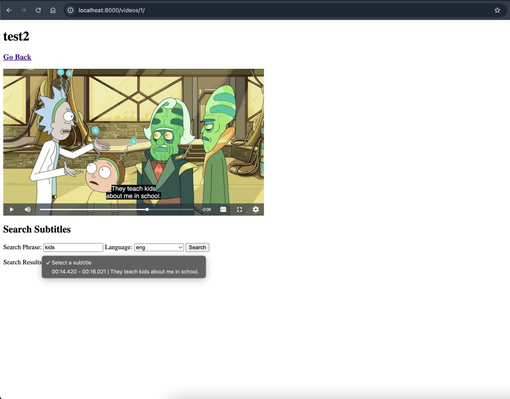

# Django Developer Assignment

We at Fatmug are looking for a candidate to help develop, maintain, and optimize our backend infrastructure to scale and manage our product as we grow exponentially.

## Assignment

1. **Video Upload and Processing**: Develop a website that allows users to upload videos, which will be processed in the background. After processing and extracting subtitles from the video, the subtitles should be returned to the frontend, integrated with the video, and displayed as closed captions. Ensure that the logic supports multiple language subtitles.

2. **Search Functionality**: Implement a search feature on the website that enables users to search for a phrase within the video and retrieve the timestamp of its occurrence. When a user clicks on the timestamp, the video should start playing from that specific point. Ensure that the search functionality is case-insensitive.

3. **List View for Uploaded Videos**: Implement a list view for uploaded video files. When a video file is selected, it should retrieve the corresponding video and subtitles, and provide all the aforementioned features.

### Requirements

1. **Subtitle Extraction**: Utilize `ccextractor` for extracting subtitles from videos. The use of any other service for subtitle extraction is not permitted.
2. **Docker**: Containerize the entire application, including the Django backend, PostgreSQL database, and any other services, using Docker. Provide a `docker-compose.yml` file to facilitate easy setup of the development environment.
3. **Backend**: Develop the backend using Django.
4. **Frontend**: The UI (frontend) of the website will not be a criterion for judgment. Therefore, a simple and functional frontend is acceptable. Evaluation will be based solely on the use of Django and PostgreSQL.
5. **Storage**: Store the processed videos in the Django media folder and save the extracted subtitles in a PostgreSQL database.
6. **Test Case**: The web application should successfully process and handle the provided sample video.

### Submission

- Include a `screenshots` folder in the project directory containing screenshots of the application in use. Capture screenshots of every possible action.
- Upload the project to GitHub and provide the repository link.

## Prerequisites

- ffmpeg
- ffprobe

## How to Install in Ubuntu

- sudo apt install ffmpeg

## How to Run
- Docker compose up -d
- Ui will accessible at http://localhost:8000
- Flower Ui will accessible at http://localhost:5555

## How to Run Test Cases
- docker compose exec backend sh -c 'python manage.py test'

# NOTE
**I tied ccextractor. But ccextractor is not able to found out embedded subtitles. But cc extractor internally using ffmpeg
so i am directly using ffmpeg despite ccextractor.**

# Demo

[Watch the Demo](https://drive.google.com/file/d/117xAoKtbkKtGWGets1ddQtmktCEKVAH3/view?usp=sharing)

# Sample Clicks

